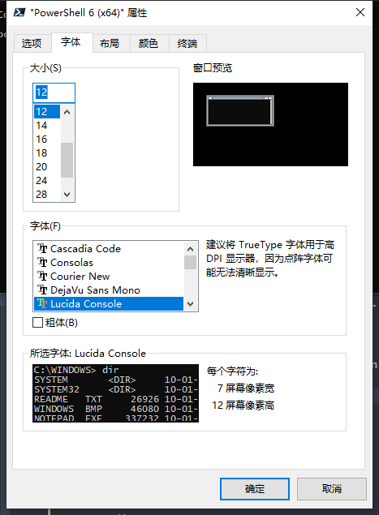

<p align="right"><a href="./README.md">En</a> | 简</p>

# PowerShell的配置文件 —— PowerShell's profile

**From [sidney zhang](https://lyzhang.me)**

Last updated on 2019-11-13

我的PowerShell备忘，主要针对PowerShell5.1 和 Core 6.x。 总之我感觉微软太疯狂了，配置文件（profile.ps1）竟然也是一个脚本……这让我开始的时候有点懵逼，不知道怎么下手……

## 配置文件在哪？

很简单就可以找到 :

```powershell
PS > $PROFILE

C:\Users\<user_name>\Documents\WindowsPowerShell\Microsoft.PowerShell_profile.ps1
```

当然这并非全部配置文件可保存的位置，还有 :

```powershell
PS > $PROFILE | Format-List -Force

AllUsersAllHosts       : C:\Windows\System32\WindowsPowerShell\v1.0\profile.ps1
AllUsersCurrentHost    : C:\Windows\System32\WindowsPowerShell\v1.0\Microsoft.PowerShell_profile.ps1
CurrentUserAllHosts    : C:\Users\<user_name>\Documents\WindowsPowerShell\profile.ps1
CurrentUserCurrentHost : C:\Users\<user_name>\Documents\WindowsPowerShell\Microsoft.PowerShell_profile.ps1
Length                 : 75

```

在 [微软官方的文档里](https://docs.microsoft.com/en-us/powershell/module/microsoft.powershell.core/about/about_profiles?view=powershell-6)[^1] , 可以看到更详细的介绍。所以我就不多写了。

## 创建PowerShell配置文件

首先，需要确定的是，也一定会是你想问的问题，那就是配置文件现在是否已经存在？有两个方法可以确定：

1. 打开文件夹，找一找。
2. 或者使用一个命令来确定[^2] :

```powershell
PS > Test-Path -Path $PROFILE

True
```

输出了“True”，就说明文件存在。如果不是，就需要咱们自己建立一个了。

然后就是怎么建立一个配置文件呢？

这个也非常简单：

- 用笔记本新建一个空文件，命名为“profile.ps1”，并保存到对应位置就可以了。
- 当然也可以用代码解决：

```powershell
PS > New-Item -Path $PROFILE -Name "profile.ps1" -ItemType "file" -Value "#profile..."

    目录: C:\Users\<user_name>\Documents\WindowsPowerShell


Mode                LastWriteTime         Length Name
----                -------------         ------ ----
-a----       2019/10/18     17:25             17 profile.ps1
```

完成之后，就可以按照你自己的喜欢配置PowerShell了。

## 定制你的PowerShell

我的PowerShell外观，看起来大致是这样：


你可以使用我的配置文件：

```powershell
PS > $fl = "https://github.com/SidneyLYZhang/PowerShell_profile/raw/master/Install_Modules.ps1"
PS > $outfl = $HOME + "\Downloads\Install_Modules.ps1"
PS > (New-Object System.Net.WebClient).DownloadFile($fl,$outfl)
PS > Set-Location $HOME\Downloads\
PS > Start-Process PowerShell -Verb RunAS -ArgumentList ".\Install_MOdules.ps1"
```

使用我的配置就不要忘记修文件名，保存到你喜欢的配置文件的位置上。

**如何选择配置文件位置呢？**

你可以从 [微软官方文档里](https://docs.microsoft.com/en-us/powershell/module/microsoft.powershell.core/about/about_profiles?view=powershell-6#how-to-choose-a-profile) 了解到相关信息。我选的是 "Current User All Hosts" 这个位置。

现在就来看看怎么创建一个PowerShell的配置吧。

### PowerShell的配置入门

微软有一句很厉害的话，用来说明PowerShell的配置文件要怎么设置 :

> You can fill it with the variables, aliases, and commands that you use frequently.
> 你可以用哪些你用着顺手的变量、别名和命令来填写配置文件。

基于这句话，就能配置PowerShell了。

就像我一开始说的，配置文件就是一个脚本。而且这个脚本是PowerShell初始运行时就会运行的内容。为了便于理解，

据这样一个例子：

```powershell
function now_weather
{
    param(
        [String] $userkey
    )
    $path = "https://free-api.heweather.net/s6/weather/now?location=auto_ip&key=";
    $data = Invoke-RestMethod ($path+$userkey);
    $timenow = Get-Date;
    $results = [ordered]@{
        1 = ("Current Weather" , $data.HeWeather6.now.cond_txt);
        2 = ("Current Temperature" , ("{0:0.0} Celsius" -f $data.HeWeather6.now.tmp));
        3 = ("Somatosensory Temperature" , ("{0:0.0} Celsius" -f $data.HeWeather6.now.fl));
        4 = ("Humidity" , ($data.HeWeather6.now.hum + "%"));
        5 = ("Wind" , ($data.HeWeather6.now.wind_dir + $data.HeWeather6.now.wind_spd + " Level"));
        6 = ("Visibility" , ($data.HeWeather6.now.vis + " Kilometers"))
    }
    Write-Host ($timenow.ToString("D") + " " + $timenow.ToString("dddd") + " " + $timenow.ToString("T"))
    $results.Keys | foreach {
        $tx = "$($results[$_-1][0]) : $($results[$_-1][1])";
        Write-Host $tx
    }
}

now_weather -userkey "<yourappkey>"
```

其中，使用了 [和风天气](https://dev.heweather.com/) 的API，你可以在其上注册取得自己的APPKey。当然你也可以选择自己喜欢的天气服务提供商的API。

把这段代码加入到你的配置文件之后打开PowerShell时你就可以看到如下信息，这就是基本的PowerShell配置的方式:

```powershell
2019年10月21日 星期一 16:20:49
Current Weather : 晴
Current Temperature : 20 Celsius
Somatosensory Temperature : 20 Celsius
Humidity : 40%
Wind : 南风2 Level
Visibility : 16 Kilometers
```

在Linux里有一个命令工具叫 "screenfetch"[^3], 它大概一般看起来是这样的 :


如果你想在打开PowerShell时也看到类似的信息，你需要安装 [Windows Screenfetch](https://www.powershellgallery.com/packages/windows-screenfetch/1.0.2) ，使用 `Install-Module -Name windows-screenfetch -Scope CurrentUser` 安装. 然后你可以测试信息的输出:

```powershell
PS > Screenfetch
                         ....::::       alfch@NIENOR-SZC
                 ....::::::::::::       OS: Microsoft Windows 10 家庭中文版 64 位
        ....:::: ::::::::::::::::       Kernel: 10.0.18362
....:::::::::::: ::::::::::::::::       Uptime: 7d 6h 16m 42s
:::::::::::::::: ::::::::::::::::       Motherboard: ASUSTeK COMPUTER INC. UX391UA
:::::::::::::::: ::::::::::::::::       Shell: PowerShell 5.1.18362.145
:::::::::::::::: ::::::::::::::::       Resolution: 1920 x 1080
:::::::::::::::: ::::::::::::::::       Window Manager: DWM
................ ................       Font: Segoe UI
:::::::::::::::: ::::::::::::::::       CPU: Intel(R) Core(TM) i7-8550U CPU @ 1.80GHz
:::::::::::::::: ::::::::::::::::       GPU Intel(R) UHD Graphics 620
:::::::::::::::: ::::::::::::::::       RAM: 5948MB / 8048 MB (74%)
'''':::::::::::: ::::::::::::::::       Disk C: 136GB / 476GB (29%)
        '''':::: ::::::::::::::::
                 ''''::::::::::::
                         ''''::::


```

测试通过之后，你就可以把这个命令加入到你的配置文件了,以后每次打开PowerShell就都可以看到这些信息。

### 搞个漂亮的外观

现在你已经可以弄出来一个十分厉害的开始屏幕了，那就让我们继续吧PowerShell弄漂亮吧！

从命令行提示符开始，对于PowerShell的命令行，默认情况只有当前路径，我们希望这里能有更多信息，比如用户、系统状态、开发状态等等信息。

最简单的方法是，安装 "oh-my-posh" 这个模块：

```powershell
PS > Install-Module posh-git -Scope CurrentUser
PS > Install-Module oh-my-posh -Scope CurrentUser
```

然后我们加载这个模块，并设定主题为 "Paradox" :

```powershell
PS > Import-Module posh-git
PS > Import-Module oh-my-posh
PS > Set-Theme Paradox
```

你将看到如下命令行提示符的样子:


至此我们就得到了一个基本满足我们需要的命令行提示符。当然我们也是可以定制化"oh-my-posh"主题的。

现在不好看的也就是颜色和字体了。为了配置这两个东西，我们有两个方案处理：

- 如果你不想用或者不能用 [Windows Terminal](https://github.com/Microsoft/Terminal) 。那么就需要使用 ["ColorTool"](https://github.com/microsoft/terminal/tree/master/src/tools/ColorTool)来进行配置。
- 如果你愿意使用Windows Terminal，那么就可以集中配置windows下的各种命令行工具了。

#### 使用ColorTool

使用ColorTool定制化Shell界面一共需要五步[^4] :

1. 下载ColorTool，并解压zip文件；
2. 跳转到戒烟的文件夹下；
3. 打开PowerShell并输入代码:

```powershell
PS > colortool "solarized_dark"
```

4. 打开属性对话框；
5. 确认当前配置，并点击ok键。

如果你需要了解更多信息，可以打开 [微软关于colortool的官方说明](https://devblogs.microsoft.com/commandline/introducing-the-windows-console-colortool/) 看一看。 

#### 使用Windows Terminal

Windows Terminal已经包含了ColorTool，所以配置的时候可以更容易和便捷。 

只需要在配置文件的两个位置定制化填写，即可实现配置。打开名为"Profiles.json"的配置文件。在这个文件中，我们可以看到四个部分，分别为："$schema"、"Globals"、"Profiles"和"Schemes"。其中，“schema” 是一个常量，这个常量一般为："https://aka.ms/terminal-profiles-schema"。

开始设置：

**第一步** : 选择颜色主题

从 [iTerm2-Color-Schemes](https://github.com/mbadolato/iTerm2-Color-Schemes) 里面你可以找到很多颜色主题，从中选一个你喜欢的，并记住这个配色的名字。

然后到 [配色方案的文件列表](https://github.com/mbadolato/iTerm2-Color-Schemes/tree/master/windowsterminal) 中找到你喜欢的配色方案，拷贝其中的代码到你的配置文件里。不过要注意使用json的格式进行配置。

比如: 

```json
{
    "$schema": "https://aka.ms/terminal-profiles-schema",
    "globals" : [...],
    "profiles" : [...],
    "schemes" : 
        [
            {
                "name": "Solarized Dark Higher Contrast",
                "black": "#002831",
                "red": "#d11c24",
                "green": "#6cbe6c",
                "yellow": "#a57706",
                "blue": "#2176c7",
                "purple": "#c61c6f",
                "cyan": "#259286",
                "white": "#eae3cb",
                "brightBlack": "#006488",
                "brightRed": "#f5163b",
                "brightGreen": "#51ef84",
                "brightYellow": "#b27e28",
                "brightBlue": "#178ec8",
                "brightPurple": "#e24d8e",
                "brightCyan": "#00b39e",
                "brightWhite": "#fcf4dc",
                "background": "#001e27",
                "foreground": "#9cc2c3"
            }
        ]
    }
```

在这个例子里，我使用的时名为 "Solarized Dark Higher Contrast" 的配色方案.

**最后** : 编辑通用部分

在 "profile.json" 里面，找到"profiles"的部分添加如下代码:

```json
{
    "$schema": "https://aka.ms/terminal-profiles-schema",
    "globals":[...],
    "profiles":[
        {
            "acrylicOpacity" : 0.75,
            "closeOnExit" : true,
            "colorScheme" : "Solarized Dark Higher Contrast",
            "commandline" : "powershell.exe",
            "cursorColor" : "#657B83",
            "cursorShape" : "bar",
            "fontFace" : "Sarasa Term SC",
            "fontSize" : 12,
            "guid" : "{61c54bbd-c2c6-5271-96e7-009a87ff44bf}",
            "historySize" : 9001,
            "icon" : "ms-appdata:///Local/powershell_32px.png",
            "name" : "PowerShell",
            "padding" : "0, 0, 0, 0",
            "snapOnInput" : true,
            "startingDirectory" : "%USERPROFILE%",
            "useAcrylic" : true,
            "tabTitle" : "PowerShell"
        },
    ],
    "schemes":[
        {
            "name": "Solarized Dark Higher Contrast",
            "black": "#002831",
            "red": "#d11c24",
            "green": "#6cbe6c",
            "yellow": "#a57706",
            "blue": "#2176c7",
            "purple": "#c61c6f",
            "cyan": "#259286",
            "white": "#eae3cb",
            "brightBlack": "#006488",
            "brightRed": "#f5163b",
            "brightGreen": "#51ef84",
            "brightYellow": "#b27e28",
            "brightBlue": "#178ec8",
            "brightPurple": "#e24d8e",
            "brightCyan": "#00b39e",
            "brightWhite": "#fcf4dc",
            "background": "#001e27",
            "foreground": "#9cc2c3"
        }
    ]
}
```

这段代码的含义，你可以从 [官方文档中](https://github.com/microsoft/terminal/blob/master/doc/cascadia/SettingsSchema.md#profiles)[^5] 了解到。关键属性有:

- "colorScheme" : 配色方案名称；
- "fontFace" : 我选择的是 "[Sarasa Term SC](https://github.com/be5invis/Sarasa-Gothic)"，它是一个开源字体。
- "guid" : 配置文件的唯一性ID。你可以使用原始的ID，也可以生成一个新的： `[GUID]::NewGUID()` 或 `[GUID]::NewGUID().ToString()`.

### 安装并使用你喜欢的字体

在Windows Terminal里，你可以在配置文件 "profile.json"里面进行字体配置。对于PowerShell自身，可以在设置里进行配置：



哪一种字体最好呢？最好还是等距字体。比如我使用的 "Sarasa Term SC"。

[Nerd Fonts](https://github.com/ryanoasis/nerd-fonts) 或者在 [PowerLine](https://github.com/powerline/fonts) 标识地字体也都很不错。对于中文和日文，我还是认为 “Sarasa Term” 系列字体好看一些。

### 定制"oh-my-posh"主题

"oh-my-posh"的主题当然也是可以定制的。同样的，"oh-my-posh" 主题是一个模型文件("yourTheme.psm1")，一般看起来是这样的[^6] ：

```powershell
#requires -Version 2 -Modules posh-git

function Write-Theme
{
    param(
        [bool]
        $lastCommandFailed,
        [string]
        $with
    )
    # 在这输入你的提示符代码模板
}

$sl = $global:ThemeSettings #本地设置
```

如果你不想从头创建一个，当然也是可以复制一各现有的主题并修改它。 

## One More Thing

使用Windows Terminal，一般你都可以很容易的建立一个新的使用SSH来连接的远程服务器Shell。因为你进需要添加一小段代码，甚至更改都不需要很多就可以实现。

比如，我需要一个阿里云服务器的Shell我只需要类似这样配置:

```json
{
    "$schema": "https://aka.ms/terminal-profiles-schema",
    "globals":[...],
    "profiles":[
        {
            "acrylicOpacity" : 0.75,
            "closeOnExit" : true,
            "colorScheme" : "Solarized Dark Higher Contrast",
            "commandline" : "ssh sidney@yourid.in.cloud",
            "cursorColor" : "#657B83",
            "cursorShape" : "bar",
            "fontFace" : "Sarasa Term SC",
            "fontSize" : 12,
            "guid" : "{61c54bbd-c2c6-5271-96e7-009a87ff44bf}",
            "historySize" : 9001,
            "icon" : "ms-appdata:///Local/aliyun_32px.ico",
            "name" : "Aliyun",
            "padding" : "0, 0, 0, 0",
            "snapOnInput" : true,
            "startingDirectory" : "%USERPROFILE%",
            "useAcrylic" : true,
            "tabTitle" : "Aliyun"
        },...
    ],
    "schemes":[...]
}
```

另外，在Windows10 1809版本之后，就已经有了OpenSSH。如果你的系统没有，那么就需要下载安装一个了，你可以在 [OpenSSH in Windows](https://docs.microsoft.com/en-us/windows-server/administration/openssh/openssh_overview) 了解到足够的信息。同个这个介绍，你可以了解到如何得到SSH以及如何使用它。

使用SSH连接你的云服务器，可以使用这样的两个方式实现：

1. 使用用户名、密码的SSH连接 : `ssh user@ip.address`
2. 通过SSH Key连接，需要拷贝你的公共密钥到你的服务器上： 

```powershell
PS > ssh-keygen -t rsa -f "<key file name>" -C "<email or remarks>"
PS > cat "~/.ssh/<key file name>_rsa.pub"
```

你也可以从 [这个网页](https://yq.aliyun.com/articles/654813) 学习怎么使用SSH，或者是在 [SSH.com](https://www.ssh.com/ssh/keygen/) 了解到。对于 `ssh-keygen` 这个命令，你也可以从Linux的命令介绍中了解到其他信息([中文](https://wangchujiang.com/linux-command/) / [英文](http://cheatsheetworld.com/programming/unix-linux-cheat-sheet/))。

******

## 附录

### (1) 修复乱码

有些时候，你使用的字体在oh-my-posh中会出现乱码。一般是因为这些字体可能没有包含一些字符，例如表情字符。看起来与此较相似：


[Andot（小马哥）](https://coolcode.org) 在他的 [blog](https://coolcode.org/2018/03/16/how-to-make-your-powershell-beautiful/)[^7] 中，提供了一个解决方案：

> 在注册表中添加一个新的键值，填写如下信息 :

```
MICROSS.TTF,Microsoft Sans Serif,108,122
MICROSS.TTF,Microsoft Sans Serif
MINGLIU.TTC,PMingLiU
MSMINCHO.TTC,MS PMincho
BATANG.TTC,Batang
MSYH.TTC,Microsoft YaHei UI
MSJH.TTC,Microsoft JhengHei UI
YUGOTHM.TTC,Yu Gothic UI
MALGUN.TTF,Malgun Gothic
SEGUISYM.TTF,Segoe UI Symbol
```

> 这个新键的名称取决于你使用的字体，保存位置一般为注册表 `计算机\HKEY_LOCAL_MACHINE\SOFTWARE\Microsoft\Windows NT\CurrentVersion\FontLink\SystemLink` 里面。

我选择的字体是 `Sarasa Term SC` 所以我的键名就是这个。

### (2) 在PowerShell里面设置Ailias

Alias在使用Shell的时候是非常有用的，PowerShell在初始已经包含了一部分默认的Alias，比如： `ls` 就是 `Get-ChildItem` 的Alias。 当然， `Get-ChildItem` 有很多不同的Alias： `ls` , `dir` 和 `gci` 。对于这些Alias你是可以替换的，比如： [Andot（小马哥）](https://coolcode.org) 就写了一个新函数来替换 `ls` [^8]。 你可以使用 `Get-Alias` 命令，来查看系统中当前都有哪些Alias（这里简单示意一下其中10个）：

```powershell
PS > Get-Alias | Select -last 10

CommandType     Name                                               Version    Source
-----------     ----                                               -------    ------
Alias           sv -> Set-Variable
Alias           swmi -> Set-WmiInstance
Alias           tee -> Tee-Object
Alias           trcm -> Trace-Command
Alias           type -> Get-Content
Alias           upmo -> Update-Module                              2.2.1      PowerShellGet
Alias           wget -> Invoke-WebRequest
Alias           where -> Where-Object
Alias           wjb -> Wait-Job
Alias           write -> Write-Output
Alias           .....................................

```

在linux里面，建立alias是使用 `alias` 命令[^9]，在powershell里面，则使用 `Set-Alias` 或者 `New-Alias` 建立alias[^10]。

```powershell
function Get-ChildItem-AllName {Get-ChildItem -Recurse -Name}
function Get-ChildItem-All {Get-ChildItem -Recurse -Force}
function Get-ChildItem-Here {Get-ChildItem -Name}
Set-Alias -Name ll -Value Get-ChildItem-Here
Set-Alias -Name lla Get-ChildItem-ALLName
Set-Alias la Get-ChildItemColorFormatWide
Set-Alias ls Get-ChildItem-All
```

这是我的一个Alias示例。

### (3) 定制化VSCode中的PowerShell Integrated Console

在VS Code里面，有一个特殊版本的Shell，叫做 "PowerShell Integrated Console"。可以当作普通的PowerShell进行操作。

比如获取基本信息：

```powershell
PS > $profile
C:\Users\<username>Documents\PowerShell\Microsoft.VSCode_profile.ps1
PS > $HOST

Name             : Visual Studio Code Host
Version          : 2019.9.0
InstanceId       : d44f81da-7411-4770-a067-c51f1b6d4a22
UI               : System.Management.Automation.Internal.Host.InternalHostUserInterface      
CurrentCulture   : zh-CN
CurrentUICulture : zh-CN
PrivateData      : Microsoft.PowerShell.EditorServices.EditorServicesPSHost+ConsoleColorProxy
DebuggerEnabled  : True
IsRunspacePushed : False
Runspace         : System.Management.Automation.Runspaces.LocalRunspace

```

这个版本的PowerShell的配置文件名为 "Microsoft.VSCode_profile.ps1"。当然，你可以直接使用PoweShell的配置文件，也仅仅需要改个名字。你可以从 [VSCode Documents](https://code.visualstudio.com/docs/editor/integrated-terminal) 获得更详细的关于这个VSCode内置PowerShell的信息。

### (4) 更多信息

对于"json"：你可以从 [这个官方文档](http://www.ecma-international.org/publications/files/ECMA-ST/ECMA-404.pdf)[^12]中，了解并学习到更多内容。如果你想从头开始学习JSON，你可以读一读这个IBM的 [网页](https://www.ibm.com/developerworks/cn/web/wa-lo-json/index.html) ，这是一个不错的入门介绍。

对于PowerShell的一些使用：你可以关注微软的 [Dr. Scripto](https://devblogs.microsoft.com/scripting/author/the-scripting-guys/) 。他分享了很多很多的PowerShell脚本示例。 

关于天气的API：你可以从这个GitHub仓库中找到很多 : [Public APIs](https://github.com/public-apis/public-apis#weather) 。

如果你想看一看更多厉害的人的PowerShell配置文件，你可以在GitHub的这个页面里看到很多 —— [GitHub Topic : PowerShell-profile](https://github.com/topics/powershell-profile)。

最后是一些对于使用PowerShell比较有帮助的资料，我认为值得多看看：

- [About Automatic Variables](https://docs.microsoft.com/en-us/powershell/module/microsoft.powershell.core/about/about_automatic_variables?view=powershell-6) : 这个页面详细介绍了PowerShell的变量。尤其是全局静态变量的设置等。
- [About Scopes](https://docs.microsoft.com/en-us/powershell/module/microsoft.powershell.core/about/about_scopes?view=powershell-6) : 变量或者函数的类型，当你要写有用的自用功能时，就很必须了。
- [New-Variable](https://docs.microsoft.com/zh-cn/powershell/module/microsoft.powershell.utility/new-variable?view=powershell-6) : 怎么使用comlet命令 "New-Variable" 来创建一个变量。
- [PowerShell自动化变量](https://www.pstips.net/powershell-automatic-variables.html) : 中文的使用介绍和很有帮助的例子。
- [PowerShell学习备忘](https://cloud.tencent.com/developer/article/1120422) : PowerShell语法。
- [PowerShell环境变量](https://www.pstips.net/powershell-environment-variables.html) ： PowerShell的系统变量介绍。

******

## 参考文献

[^1]: Microsoft : [About topics cover a ranges of concepts about PowerShell.](https://docs.microsoft.com/en-us/powershell/module/microsoft.powershell.core/about/?view=powershell-6)

[^2]: Microsoft : [Microsoft.PowerShell.Management](https://docs.microsoft.com/en-us/powershell/module/microsoft.powershell.management/?view=powershell-6)

[^3]: KittyKatt : [screenFetch](https://github.com/KittyKatt/screenFetch)

[^4]: Craig/from Microsoft , 2017-08-11 : [Introducing the Windows Console Colortool](https://devblogs.microsoft.com/commandline/introducing-the-windows-console-colortool/)

[^5]: Microsoft : [Windows Terminal Documents](https://github.com/microsoft/terminal/tree/master/doc)

[^6]: JanDeDobbeleer : [oh-my-posh](https://github.com/JanDeDobbeleer/oh-my-posh)

[^7]: Andot , 2018-03-16 : [PowerShell 美化指南](https://coolcode.org/2018/03/16/how-to-make-your-powershell-beautiful/)

[^8]: Andot , 2018-03-19 : [几个有用的 PowerShell 脚本](https://coolcode.org/2018/03/19/some-useful-scripts-of-powershell/)

[^9]: Marin Todorov , 2018-10-03 : [How to Create and Use Alias Command in Linux](https://www.tecmint.com/create-alias-in-linux/)

[^10]: Microsoft : [About Alias](https://docs.microsoft.com/en-us/powershell/module/microsoft.powershell.core/about/about_aliases?view=powershell-6)

[^11]: 和风天气 : [和风天气-快速开始](https://dev.heweather.com/docs/getting-started/)

[^12]: JSON : [ECMA-404 The JSON Data Interchange Standard.](http://www.ecma-international.org/publications/files/ECMA-ST/ECMA-404.pdf)

******

## LICENSE


This work by [Sidney Zhang](https://github.com/SidneyLYZhang/PowerShell_profile) is licensed under a [Creative Commons Attribution-NonCommercial-ShareAlike 4.0 International](https://creativecommons.org/licenses/by-nc-sa/4.0/) License.

This codes from this repository is licensed under [MIT license](https://mit-license.org/).
