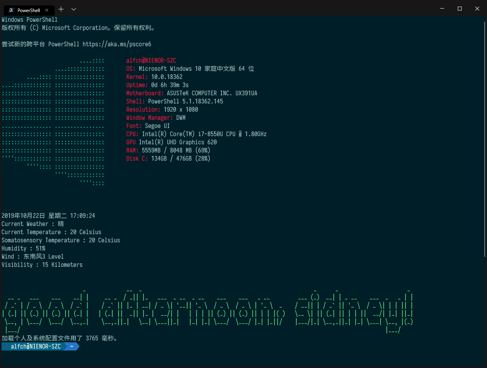
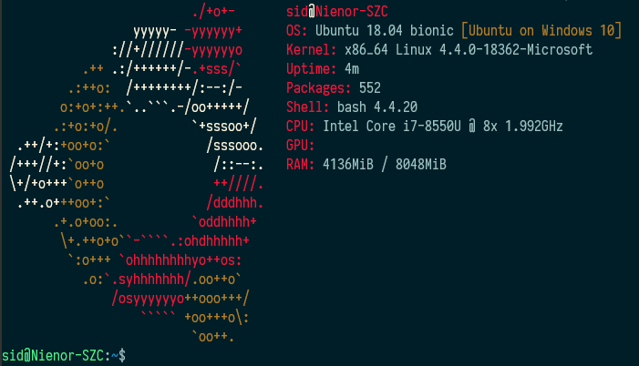
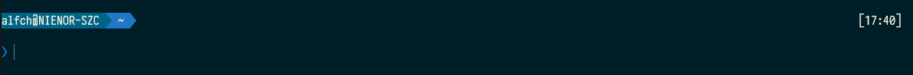
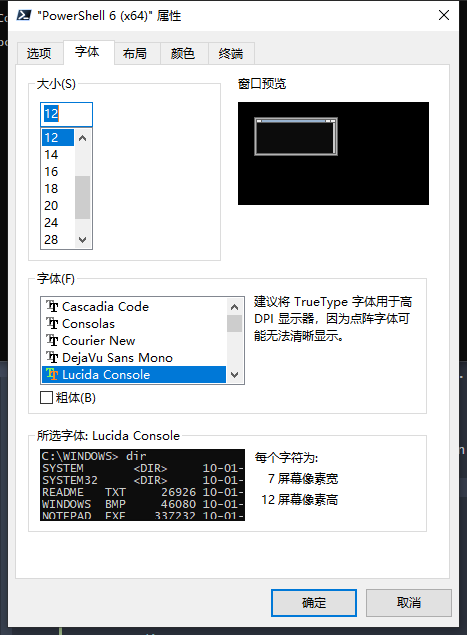

<p align="right">En | <a href="./README-CN.md">简</a></p>

# PowerShell Profile 

**From [sidney zhang](https://lyzhang.me)**

Last updated on 2019-11-13

This is my configuration files for PowerShell(5.1 and Core 6). In PowerShell this config-file called "profile.ps1".
Of course, this config-file is a powershell script. It's crazy, isn't it?

## Where are those Config-Files(profile)?

As simple :

```powershell
PS > $PROFILE

C:\Users\<user_name>\Documents\WindowsPowerShell\Microsoft.PowerShell_profile.ps1
```

For all locations of those config-files :

```powershell
PS > $PROFILE | Format-List -Force

AllUsersAllHosts       : C:\Windows\System32\WindowsPowerShell\v1.0\profile.ps1
AllUsersCurrentHost    : C:\Windows\System32\WindowsPowerShell\v1.0\Microsoft.PowerShell_profile.ps1
CurrentUserAllHosts    : C:\Users\<user_name>\Documents\WindowsPowerShell\profile.ps1
CurrentUserCurrentHost : C:\Users\<user_name>\Documents\WindowsPowerShell\Microsoft.PowerShell_profile.ps1
Length                 : 75

```

In [Microsoft official documentation](https://docs.microsoft.com/en-us/powershell/module/microsoft.powershell.core/about/about_profiles?view=powershell-6)[^1] , you can also find this information.

## Create a Config-File

First, you will ask, whether this config-file already exists. Two ways to confirm this question:

1. open this folder and find it. 
2. or, use a command line[^2] :

```powershell
PS > Test-Path -Path $PROFILE

True
```

If this output is "True", that means, this config-file is already existing. If not , you need to create one for powershell.

Second, how to create one config-file?

It's also too easy to reach the destination:

- Use notepad to create a new file, and save it as "profile.ps1" in that folder.
- Use another command line to automatically create one :

```powershell
PS > New-Item -Path $PROFILE -Name "profile.ps1" -ItemType "file" -Value "#profile..."

    目录: C:\Users\<user_name>\Documents\WindowsPowerShell


Mode                LastWriteTime         Length Name
----                -------------         ------ ----
-a----       2019/10/18     17:25             17 profile.ps1
```

After all, you will be able to edit this file to deploy your PowerShell on your preferences. Of course, you can use my favorite profile.

## Customize Your PowerShell

My favorite PowerShell Lookview:



You can get my profile in this way:

```powershell
PS > $fl = "https://github.com/SidneyLYZhang/PowerShell_profile/raw/master/Install_Modules.ps1"
PS > $outfl = $HOME + "\Downloads\Install_Modules.ps1"
PS > (New-Object System.Net.WebClient).DownloadFile($fl,$outfl)
PS > Set-Location $HOME\Downloads\
PS > Start-Process PowerShell -Verb RunAS -ArgumentList ".\Install_MOdules.ps1"
```

Also you can clone my repository, and change them by yourself. 
At last, don't forget to rename this profile by your choise.

***How to choose a profile ?**

You can understand this information from [Windows official document](https://docs.microsoft.com/en-us/powershell/module/microsoft.powershell.core/about/about_profiles?view=powershell-6#how-to-choose-a-profile) . My choise is for "Current User All Hosts".

Now let's look at the way to how to create new profile.

### Start a profile of powershell

There are Powerful Words from Microsoft :

> You can fill it with the variables, aliases, and commands that you use frequently.

Using this 'spell', you will be able to create your own profile.ps1

As I said in the beginning, PowerShell's profile is also a PowerShell script. So you need to use this profile as a script that will be automatically run before openning the shell.

For example :

```powershell
function now_weather
{
    param(
        [String] $userkey
    )
    $path = "https://free-api.heweather.net/s6/weather/now?location=auto_ip&key=";
    $data = Invoke-RestMethod ($path+$userkey);
    $timenow = Get-Date;
    $results = [ordered]@{
        1 = ("Current Weather" , $data.HeWeather6.now.cond_txt);
        2 = ("Current Temperature" , ("{0:0.0} Celsius" -f $data.HeWeather6.now.tmp));
        3 = ("Somatosensory Temperature" , ("{0:0.0} Celsius" -f $data.HeWeather6.now.fl));
        4 = ("Humidity" , ($data.HeWeather6.now.hum + "%"));
        5 = ("Wind" , ($data.HeWeather6.now.wind_dir + $data.HeWeather6.now.wind_spd + " Level"));
        6 = ("Visibility" , ($data.HeWeather6.now.vis + " Kilometers"))
    }
    Write-Host ($timenow.ToString("D") + " " + $timenow.ToString("dddd") + " " + $timenow.ToString("T"))
    $results.Keys | foreach {
        $tx = "$($results[$_-1][0]) : $($results[$_-1][1])";
        Write-Host $tx
    }
}

now_weather -userkey "<yourappkey>"
```

From [website HeWeather(和风天气)](https://dev.heweather.com/), you can get your appkey after registration. Of course, you can change the API into your favorite weather-information-service.

After adding this script funcion in your profile, when you open your PowerShell, you will see the information like :

```powershell
2019年10月21日 星期一 16:20:49
Current Weather : 晴
Current Temperature : 20 Celsius
Somatosensory Temperature : 20 Celsius
Humidity : 40%
Wind : 南风2 Level
Visibility : 16 Kilometers
```

In Linux there are a interesting commandline called "screenfetch"[^3], it's look like this :



If you want to get the computer information like that, you can install the [Windows Screenfetch](https://www.powershellgallery.com/packages/windows-screenfetch/1.0.2) by `Install-Module -Name windows-screenfetch -Scope CurrentUser` . Then you can get this screenfetch information in this way :

```powershell
PS > Screenfetch
                         ....::::       alfch@NIENOR-SZC
                 ....::::::::::::       OS: Microsoft Windows 10 家庭中文版 64 位
        ....:::: ::::::::::::::::       Kernel: 10.0.18362
....:::::::::::: ::::::::::::::::       Uptime: 7d 6h 16m 42s
:::::::::::::::: ::::::::::::::::       Motherboard: ASUSTeK COMPUTER INC. UX391UA
:::::::::::::::: ::::::::::::::::       Shell: PowerShell 5.1.18362.145
:::::::::::::::: ::::::::::::::::       Resolution: 1920 x 1080
:::::::::::::::: ::::::::::::::::       Window Manager: DWM
................ ................       Font: Segoe UI
:::::::::::::::: ::::::::::::::::       CPU: Intel(R) Core(TM) i7-8550U CPU @ 1.80GHz
:::::::::::::::: ::::::::::::::::       GPU Intel(R) UHD Graphics 620
:::::::::::::::: ::::::::::::::::       RAM: 5948MB / 8048 MB (74%)
'''':::::::::::: ::::::::::::::::       Disk C: 136GB / 476GB (29%)
        '''':::: ::::::::::::::::
                 ''''::::::::::::
                         ''''::::


```

So, after installed, put the commandline in the profile, you will see the information when you open the PowerShell.

### Getting a Beautiful Theme

Now you have understand how to edit powershell profile and a super awesome welcome information. Then let's make PowerShell beautifully.

For the Prompt of PowerShell, in default theme there is only one thing, it's the current path. We want to watch more information from Prompt, for example users, systems, development environments, version control in git and so on.

So I have installed "oh-my-posh" for PowerShell:

```powershell
PS > Install-Module posh-git -Scope CurrentUser
PS > Install-Module oh-my-posh -Scope CurrentUser
```

Then let's import these modules into PowerShell and use a theme "Paradox" :

```powershell
PS > Import-Module posh-git
PS > Import-Module oh-my-posh
PS > Set-Theme Paradox
```

You will see the prompt of PowerShell like this:



Until this point, the prompt theme basically suffices for our needs. We will customize "oh-my-posh" theme later.

But Font and Color are also not beautiful. But for these questions, you need to take a different way.

- If you didn't want to use , or can't use the newst [Windows Terminal](https://github.com/Microsoft/Terminal). So, you need to use this official Tool ["ColorTool"](https://github.com/microsoft/terminal/tree/master/src/tools/ColorTool).
- If you can use Windows Terminal, I recommend using the Windows Terminal profile for customizing.

#### Using ColorTool

Using ColorTool for customizing your Microsoft shell theme are there only five steps[^4] :

1. Just download the latest colortool release and extract the zip file.
2. Go to the path where the colortool was saved.
3. Open the Shell here and code this command line :

```powershell
PS > colortool "solarized_dark"
```

4. Right click on the window title to access the ‘Properties’ dialogue box
5. Once the properties dialogue box opens press OK (which saves the color change)

For more information, please visit [Microsoft official introduction of colortool](https://devblogs.microsoft.com/commandline/introducing-the-windows-console-colortool/). 

#### Using Windows Terminal

Windows Terminal has required ColorTool. So you can easily use default profile of Windows Terminal to customize PowerShell. 

Just two positions need to be filled by yourself. Open Terminal's Setting file (called "Profiles.json"), in this file, you can find four parts. There are "$schema", "Globals", "Profiles" and "Schemes". The schema part is default, its value is "https://aka.ms/terminal-profiles-schema" .

**First** : select a colorscheme

From [iTerm2-Color-Schemes](https://github.com/mbadolato/iTerm2-Color-Schemes), you can be able to find too many schemes, choose one from there and keep in mind its name.

Then go to the [files-list](https://github.com/mbadolato/iTerm2-Color-Schemes/tree/master/windowsterminal), find your choosed json file, and copy the code to the Terminal's profile in json format.

For example : 

```json
{
    "$schema": "https://aka.ms/terminal-profiles-schema",
    "globals" : [...],
    "profiles" : [...],
    "schemes" : 
        [
            {
                "name": "Solarized Dark Higher Contrast",
                "black": "#002831",
                "red": "#d11c24",
                "green": "#6cbe6c",
                "yellow": "#a57706",
                "blue": "#2176c7",
                "purple": "#c61c6f",
                "cyan": "#259286",
                "white": "#eae3cb",
                "brightBlack": "#006488",
                "brightRed": "#f5163b",
                "brightGreen": "#51ef84",
                "brightYellow": "#b27e28",
                "brightBlue": "#178ec8",
                "brightPurple": "#e24d8e",
                "brightCyan": "#00b39e",
                "brightWhite": "#fcf4dc",
                "background": "#001e27",
                "foreground": "#9cc2c3"
            }
        ]
    }
```

In this case, I have copied a color scheme called "Solarized Dark Higher Contrast".

**Last** : edit the "profile"-part

In "profile.json" , find the "profiles" section, and add the following code for PowerShell :

```json
{
    "$schema": "https://aka.ms/terminal-profiles-schema",
    "globals":[...],
    "profiles":[
        {
            "acrylicOpacity" : 0.75,
            "closeOnExit" : true,
            "colorScheme" : "Solarized Dark Higher Contrast",
            "commandline" : "powershell.exe",
            "cursorColor" : "#657B83",
            "cursorShape" : "bar",
            "fontFace" : "Sarasa Term SC",
            "fontSize" : 12,
            "guid" : "{61c54bbd-c2c6-5271-96e7-009a87ff44bf}",
            "historySize" : 9001,
            "icon" : "ms-appdata:///Local/powershell_32px.png",
            "name" : "PowerShell",
            "padding" : "0, 0, 0, 0",
            "snapOnInput" : true,
            "startingDirectory" : "%USERPROFILE%",
            "useAcrylic" : true,
            "tabTitle" : "PowerShell"
        },
    ],
    "schemes":[
        {
            "name": "Solarized Dark Higher Contrast",
            "black": "#002831",
            "red": "#d11c24",
            "green": "#6cbe6c",
            "yellow": "#a57706",
            "blue": "#2176c7",
            "purple": "#c61c6f",
            "cyan": "#259286",
            "white": "#eae3cb",
            "brightBlack": "#006488",
            "brightRed": "#f5163b",
            "brightGreen": "#51ef84",
            "brightYellow": "#b27e28",
            "brightBlue": "#178ec8",
            "brightPurple": "#e24d8e",
            "brightCyan": "#00b39e",
            "brightWhite": "#fcf4dc",
            "background": "#001e27",
            "foreground": "#9cc2c3"
        }
    ]
}
```

There codes mean what, you can find in [this official Documents](https://github.com/microsoft/terminal/blob/master/doc/cascadia/SettingsSchema.md#profiles)[^5]. Some importent properties :

- "colorScheme" : The name of the color scheme that you have choosed.
- "fontFace" : your favorite Font, I choosed "[Sarasa Term SC](https://github.com/be5invis/Sarasa-Gothic)", it's a open source font.
- "guid" : it's a unique ID for this profile-text. You can use the original one, or get it from PowerShell commandline `[GUID]::NewGUID()` or `[GUID]::NewGUID().ToString()`.

### Install and Use your favorite Font

In Windows Terminal, you can customize the font in "profile.json". Or only for PowerShell, you can customize it in "Setting":



But which Font is super suitable? The font is isometric type. For example "the Sarasa Term SC" that I was used.

The [Nerd Fonts](https://github.com/ryanoasis/nerd-fonts) or those fonts from [PowerLine](https://github.com/powerline/fonts) are also great. But for Chinese or Japanese, Sarasa Term SC is better in my opinion.

### Customize "oh-my-posh" Theme

You also can customize the "oh-my-posh" theme. "oh-my-posh" theme is a PowerShell Module file ("yourTheme.psm1"). It's look like[^6] :

```powershell
#requires -Version 2 -Modules posh-git

function Write-Theme
{
    param(
        [bool]
        $lastCommandFailed,
        [string]
        $with
    )
    # enter your prompt building logic here
}

$sl = $global:ThemeSettings #local settings
```

If you don't want to build one from beginning, you can copy a default theme file and change it. 

## One More Thing

In Windows Terminal , you can easily create a new shell tab to connect a remote terminal by SSH. You just need to add some code in the Terminal profile.

I need to use a Cloud Shell of Aliyun, so I biulted a remote terminal by SSH in the profile:

```json
{
    "$schema": "https://aka.ms/terminal-profiles-schema",
    "globals":[...],
    "profiles":[
        {
            "acrylicOpacity" : 0.75,
            "closeOnExit" : true,
            "colorScheme" : "Solarized Dark Higher Contrast",
            "commandline" : "ssh sidney@yourid.in.cloud",
            "cursorColor" : "#657B83",
            "cursorShape" : "bar",
            "fontFace" : "Sarasa Term SC",
            "fontSize" : 12,
            "guid" : "{61c54bbd-c2c6-5271-96e7-009a87ff44bf}",
            "historySize" : 9001,
            "icon" : "ms-appdata:///Local/aliyun_32px.ico",
            "name" : "Aliyun",
            "padding" : "0, 0, 0, 0",
            "snapOnInput" : true,
            "startingDirectory" : "%USERPROFILE%",
            "useAcrylic" : true,
            "tabTitle" : "Aliyun"
        },...
    ],
    "schemes":[...]
}
```

In Windows10 1809, there is already the OpenSSH. If your system hasn't it, you can be able to install one, [OpenSSH in Windows](https://docs.microsoft.com/en-us/windows-server/administration/openssh/openssh_overview) is a good document from Windows. Using this way, you will get the SSH and how to use it.

Using SSH to connect your Cloud shell, there are two ways of getting it :

1. SSH with username & password : `ssh user@ip.address`
2. SSH with key pair, copy this public key to your remote server: 

```powershell
PS > ssh-keygen -t rsa -f "<key file name>" -C "<email or remarks>"
PS > cat "~/.ssh/<key file name>_rsa.pub"
```

You can learn more about SSH in [this webpage from aliyun](https://yq.aliyun.com/articles/654813), or in [SSH.com](https://www.ssh.com/ssh/keygen/). About `ssh-keygen` , you can get more information from linux-commands cheat sheet([chinese](https://wangchujiang.com/linux-command/) / [english](http://cheatsheetworld.com/programming/unix-linux-cheat-sheet/)).

******

## Appendix

### (1) Repaired Garbled Codes

Sometimes, using the font that was choised by you, there are too many garbled codes. Because these Fonts don't have same Emoticons. Example like :


[Andot（小马哥）](https://coolcode.org) in his [blog](https://coolcode.org/2018/03/16/how-to-make-your-powershell-beautiful/)[^7], he gives a solution :

> In Windows Registry insert a new key of  using this code :

```
MICROSS.TTF,Microsoft Sans Serif,108,122
MICROSS.TTF,Microsoft Sans Serif
MINGLIU.TTC,PMingLiU
MSMINCHO.TTC,MS PMincho
BATANG.TTC,Batang
MSYH.TTC,Microsoft YaHei UI
MSJH.TTC,Microsoft JhengHei UI
YUGOTHM.TTC,Yu Gothic UI
MALGUN.TTF,Malgun Gothic
SEGUISYM.TTF,Segoe UI Symbol
```

> The new key called, that's name of you choosed font,  is in the registry path `计算机\HKEY_LOCAL_MACHINE\SOFTWARE\Microsoft\Windows NT\CurrentVersion\FontLink\SystemLink` .

For me, this key name is `Sarasa Term SC` that I have used in Windows Terminal.

### (2) Using Set-Alias in PowerShell

Alias is a super useful thing for using Terminal. PowerShell has same default aliases, for example , `ls` is a alias of the cmdlet command `Get-ChildItem`. And `Get-ChildItem` has some different aliases : `ls` , `dir` & `gci`. For this alias you can revise it, e.g. [Andot（小马哥）](https://coolcode.org) had coded a new function for revising `ls` [^8]. Use `Get-Alias`, you can get all aliases in your system (here just show 10 aliases in my system):

```powershell
PS > Get-Alias | Select -last 10

CommandType     Name                                               Version    Source
-----------     ----                                               -------    ------
Alias           sv -> Set-Variable
Alias           swmi -> Set-WmiInstance
Alias           tee -> Tee-Object
Alias           trcm -> Trace-Command
Alias           type -> Get-Content
Alias           upmo -> Update-Module                              2.2.1      PowerShellGet
Alias           wget -> Invoke-WebRequest
Alias           where -> Where-Object
Alias           wjb -> Wait-Job
Alias           write -> Write-Output
Alias           .....................................

```

In linux, we create aliases with `alias` command line[^9], in windows powershell, we can use `Set-Alias` or `New-Alias` to create a new alias[^10].

```powershell
function Get-ChildItem-AllName {Get-ChildItem -Recurse -Name}
function Get-ChildItem-All {Get-ChildItem -Recurse -Force}
function Get-ChildItem-Here {Get-ChildItem -Name}
Set-Alias -Name ll -Value Get-ChildItem-Here
Set-Alias -Name lla Get-ChildItem-ALLName
Set-Alias la Get-ChildItemColorFormatWide
Set-Alias ls Get-ChildItem-All
```

This is a part of my aliases. 

### (3) Customize PowerShell Integrated Console

In VS Code, there is a special console called "PowerShell Integrated Console". We can control it as a normal powershell.exe

Like in Normal PowerShell Console, we can get those informations:

```powershell
PS > $profile
C:\Users\<username>Documents\PowerShell\Microsoft.VSCode_profile.ps1
PS > $HOST

Name             : Visual Studio Code Host
Version          : 2019.9.0
InstanceId       : d44f83da-7484-4770-a067-c57f1b6d4a22
UI               : System.Management.Automation.Internal.Host.InternalHostUserInterface      
CurrentCulture   : zh-CN
CurrentUICulture : zh-CN
PrivateData      : Microsoft.PowerShell.EditorServices.EditorServicesPSHost+ConsoleColorProxy
DebuggerEnabled  : True
IsRunspacePushed : False
Runspace         : System.Management.Automation.Runspaces.LocalRunspace

```

So, wo can customize this integrated Console through editting the profile "Microsoft.VSCode_profile.ps1". Of course, you can copy the profile of powershell to the path for the VSCode_profile. You can also get more information of this integrated console from [VSCode Documents](https://code.visualstudio.com/docs/editor/integrated-terminal).

### (4) More Informations

For "json", you can learn it from [official documentation](http://www.ecma-international.org/publications/files/ECMA-ST/ECMA-404.pdf)[^12]. If you want to get started in a easy way, you can read [this webpage](https://www.ibm.com/developerworks/cn/web/wa-lo-json/index.html) from IBM.

You can follow this man called [Dr. Scripto](https://devblogs.microsoft.com/scripting/author/the-scripting-guys/) from Microsoft. This man constantly share his experience of PowerShell scripts. 

More weather API, you can be able to get in this repository : [Public APIs](https://github.com/public-apis/public-apis#weather) .

If you want to learn more personal profiles, you can search the [GitHub Topic : PowerShell-profile](https://github.com/topics/powershell-profile).

Here is a list of helpful tips for using PowerShell :

- [About Automatic Variables](https://docs.microsoft.com/en-us/powershell/module/microsoft.powershell.core/about/about_automatic_variables?view=powershell-6) : This webpage is about all of variables that are defined since pwershell openning.
- [About Scopes](https://docs.microsoft.com/en-us/powershell/module/microsoft.powershell.core/about/about_scopes?view=powershell-6) : Type of Variables or Functions.
- [New-Variable](https://docs.microsoft.com/zh-cn/powershell/module/microsoft.powershell.utility/new-variable?view=powershell-6) : How to use the function "New-Variable" .
- [PowerShell自动化变量](https://www.pstips.net/powershell-automatic-variables.html) : Useful Introduction in Chinese.
- [PowerShell学习备忘](https://cloud.tencent.com/developer/article/1120422) : Helpful grammar of powershell.
- [PowerShell环境变量](https://www.pstips.net/powershell-environment-variables.html) ： About Environment Variables of PowerShell.
- [PowerShell正则表达](https://www.w3cschool.cn/regexp/lyqo1pqa.html) : About regular expression of PowerShell.

******

## Reference

[^1]: Microsoft : [About topics cover a ranges of concepts about PowerShell.](https://docs.microsoft.com/en-us/powershell/module/microsoft.powershell.core/about/?view=powershell-6)

[^2]: Microsoft : [Microsoft.PowerShell.Management](https://docs.microsoft.com/en-us/powershell/module/microsoft.powershell.management/?view=powershell-6)

[^3]: KittyKatt : [screenFetch](https://github.com/KittyKatt/screenFetch)

[^4]: Craig/from Microsoft , 2017-08-11 : [Introducing the Windows Console Colortool](https://devblogs.microsoft.com/commandline/introducing-the-windows-console-colortool/)

[^5]: Microsoft : [Windows Terminal Documents](https://github.com/microsoft/terminal/tree/master/doc)

[^6]: JanDeDobbeleer : [oh-my-posh](https://github.com/JanDeDobbeleer/oh-my-posh)

[^7]: Andot , 2018-03-16 : [PowerShell 美化指南](https://coolcode.org/2018/03/16/how-to-make-your-powershell-beautiful/)

[^8]: Andot , 2018-03-19 : [几个有用的 PowerShell 脚本](https://coolcode.org/2018/03/19/some-useful-scripts-of-powershell/)

[^9]: Marin Todorov , 2018-10-03 : [How to Create and Use Alias Command in Linux](https://www.tecmint.com/create-alias-in-linux/)

[^10]: Microsoft : [About Alias](https://docs.microsoft.com/en-us/powershell/module/microsoft.powershell.core/about/about_aliases?view=powershell-6)

[^11]: 和风天气 : [和风天气-快速开始](https://dev.heweather.com/docs/getting-started/)

[^12]: JSON : [ECMA-404 The JSON Data Interchange Standard.](http://www.ecma-international.org/publications/files/ECMA-ST/ECMA-404.pdf)

******

## LICENSE


This work by [Sidney Zhang](https://github.com/SidneyLYZhang/PowerShell_profile) is licensed under a [Creative Commons Attribution-NonCommercial-ShareAlike 4.0 International](https://creativecommons.org/licenses/by-nc-sa/4.0/) License.

This codes from this repository is licensed under [MIT license](https://mit-license.org/).
